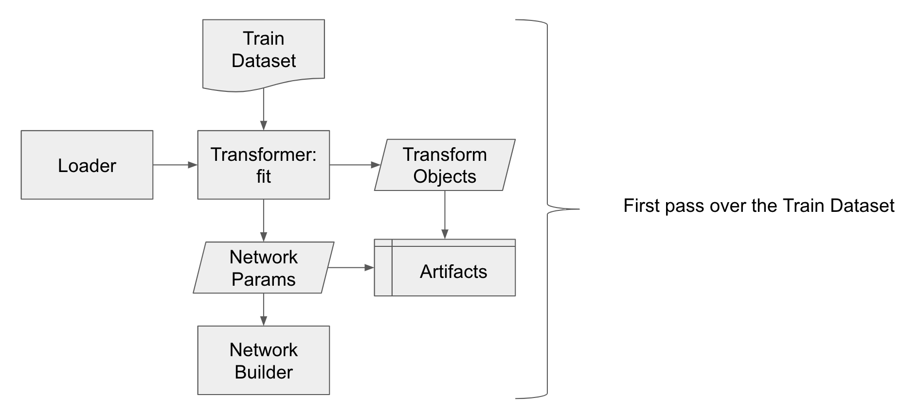
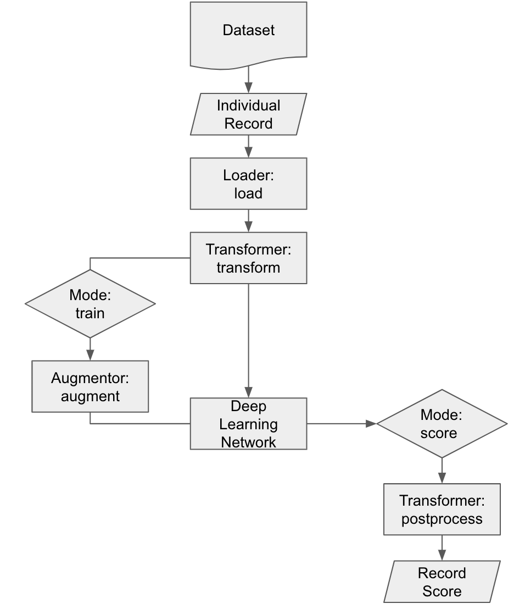

===============
Barrage Dataset
===============

.. contents:: **Table of Contents**:

Barrage datasets are flexible, performant, and powerful data iterators build around
``records`` - list of dictionaries. For smaller datasets it is often convenient for
each ``record`` to contain a direct mapping to the underlying data. For larger datasets each
``record`` can simply contain paths or references to where the data is actually stored.

Datasets are comprised of three components:

#. Loaders: load an individual record.

#. Transformers: fit transforms and apply them at batch time.

#. Augmentor: apply a chain of augmentation functions.

Datasets support the following input record types:

#. List of dictionaries

#. Pandas DataFrames

----------
High-level
----------

``TensorFlow.Keras`` has a lot of data type API combinations that can be used with ``model.fit``
whether it be ``dicts``, ``numpy arrays``, ``tensors``, ``generators``, ``sequences``, etc..

Barrage uses the ``dicts`` + ``sequences`` API for several key reasons:

#. ``dicts`` are the preferred API - using lists with multi input and multi output is error prone
   and inevitably leads to order mismatch.

#. Everything is a ``sequence`` - irrelevant for small datasets but
   an absolute necessity for large datasets.

#. **Single API** - ``sequence`` regardless of data size and ``dicts`` regardless of single/multi input/output.

**Note**: All ``input`` and ``output`` ``network layers`` **must be named**. The ``output``
layer names are required in the config to associate ``loss`` functions and ``metrics``.
The ``input`` layer names are required for the ``loader``.

~~~~~~~~~~~~~~
System Diagram
~~~~~~~~~~~~~~

Barrage supports 3 modes of data:

.. code-block:: python

  from barrage.api import RecordMode

  RecordMode.TRAIN
  RecordMode.VALIDATION
  RecordMode.SCORE

Before deep learning training begins, the transformer does a first pass over the train dataset to fit
transforms:

After deep learning training begins, the transformer applies the transform in conjunction with
loading and augmentation:

~~~~~~~~~~
Data Types
~~~~~~~~~~

Data types are critical at each hand-off between components. Here is a summary of the data types:

``InputRecords``: a list of dictionaries or a Pandas DataFrame converted to ``Records``:

.. code-block:: python

  # Example: list of dicts
  records = [{"x1": 1, "x2": 2, "y": 0}, {"x1": 2, "x2": 1, "y": 1}]

  # Example: Pandas DataFrame
  import pandas as pd

  records = pd.DataFrame([{"x1": 1, "x2": 2, "y": 0}, {"x1": 2, "x2": 1, "y": 1}])

``Record``: a dictionary that can be loaded into a ``Data Record``.

.. code-block:: python

  # Example: in memory
  record = {"x1": 1, "x2": 2, "y": 0}

  # Example: on disk
  record = {"filepath": "/tmp/bear.jpg", "label": "bear"}

``Records``: are a list of dictionaries that can each be loaded into a ``Data Record``.

.. code-block:: python

  # Example: in memory
  records = [{"x1": 1, "x2": 2, "y": 0}, {"x1": 2, "x2": 1, "y": 1}]

  # Example: on disk
  records = [{"filepath": "/tmp/cat.jpg", "label": "cat"}, {"filepath": "/tmp/dog.jpg", "label": "dog"}]

``Data Record``: a tuple of dictionaries of arrays comprising a single element of a
``TensorFlow.Keras`` batch.

.. code-block:: python

  import numpy as np

  # Example: two inputs, single output
  x = {"network_input_1": np.array([1, 2, 3]), "network_input_2": np.array([4])}
  y = {"network_output_1": np.array([0, 1])}
  w = {"network_output_1": np.array([4])}

  data_record_train = (x, y)  # or (x, y, w) if sample weights
  data_record_validation = (x, y)  # or (x, y, w) if sample weights
  data_record_score = (x,)

``Batch Data Records``: are a stacked tuple of dictionaries of arrays comprising an entire
batch.

.. code-block:: python

  import numpy as np

  # Example: two records, two inputs, single output
  x = {"network_input_1": np.array([[1, 2, 3], [5, 6, 7]]), "network_input_2": np.array([[4], [5]])}
  y = {"network_output_1": np.array([[0, 1], [1, 0]])}
  w = {"network_output_1": np.array([[4],[2]])}

  batch_data_record_train = (x, y)  # or (x, y, w) if sample weights
  batch_data_record_validation = (x, y)  # or (x, y, w) if sample weights
  batch_data_record_score = (x,)

``Record Score``: is a dictionary of arrays comprising a single elements output from
predict.

.. code-block:: python

  import numpy as np

  # Example: single output
  record_score =  {"network_output_1": np.array([0.1, 0.9])}

``Batch Record Scores``: are a list of dictionary of arrays comprising an entire batch output
predict.

.. code-block:: python

  import numpy as np

  # Example: two records, single output
  batch_records_score =  [{"network_output_1": np.array([0.1, 0.9])}, {"network_output_1": np.array([0.7, 0.3])}]

+------------------------------+-----------------+------------------+
| Component Action             | Input Data Type | Output Data Type |
+==============================+=================+==================+
| RecordDataset(...)           | Input Records   | Records          |
+------------------------------+-----------------+------------------+
| loader.load(...)             | Record          | Data Record      |
+------------------------------+-----------------+------------------+
| transformer.fit(...)         | Records         | None             |
+------------------------------+-----------------+------------------+
| transformer.score(...)       | Data Record     | Data Record      |
+------------------------------+-----------------+------------------+
| transformer.postprocess(...) | Record Score    | Record Score     |
+------------------------------+-----------------+------------------+
| augmentor.augment(...)       | Data Record     | Data Record      |
+------------------------------+-----------------+------------------+

**Note**: the underlying dataset implementation stacks ``Data Records`` into
``Batch Data Records`` and ``Record Score`` into ``Batch Record Scores`` automatically.

**Example Text Classification**:

#. Loader:

   #. Input Data - load a text file or select text key.
   #. Output Data - select label key.

#. Transformer:

   #. Fit - vocabulary to all training records, iterating over records.
   #. Pass - vocabulary size to network builder.
   #. Score - tokenize, pad text sequences, encoding.

**Example Time Series Regression**:

#. Loader:

   #. Input Data - load input stream(s) file(s) or select key(s).
   #. Output Data - load output stream(s) file(s) or select key(s).

#. Transformer:

   #. Fit - mean variance normalization to all training records, iterating over records.
   #. Score - mean variance normalize to record.
   #. Postprocess - undo mean variance normalization to records.

#. Augmentor:

   #. Add Gaussian noise.
   #. Phase shift.
   #. etc...

------
Loader
------

The loader takes a record (``Record``) and transforms it into a ``Data Record``. This could be
as simple as directly indexing the key's of the ``Record`` or loading a filepath stored in the ``Record``.

~~~~~~~~~~
Base Class
~~~~~~~~~~

.. code-block:: python

  from barrage.api import RecordLoader

``RecordLoader`` is an abstract base class with property ``self.mode`` (``RecordMode``).
To write a new ``RecordLoader`` implement the abstract ``load`` method:

.. code-block:: python

  @abc.abstractmethod
  def load(self, record: Record) -> DataRecord:  # pragma: no cover
      """Method for loading a record into DataRecord.

      Args:
          record: Record, record.

      Returns:
          DataRecord, data record.
      """
      raise NotImplementedError()

~~~~~~~~~~~
KeySelector
~~~~~~~~~~~

Barrage has a single built-in ``loader``: ``KeySelector``.

Params:

.. code:: javascript

  {
    "inputs": {input_layer_name: key or [keys], ...}
    "outputs": {output_layer_names: key or [keys], ...}
    "sample_weights": {output_layer_name: key, ...} or None
  }

-----------
Transformer
-----------

The ``transformer`` is responsible for fitting transforms to training data, applying transforms
at batch time, passing network params, and undoing scoring.

~~~~~~~~~~
Base Class
~~~~~~~~~~

.. code-block:: python

  from barrage.api import RecordTransformer

``RecordTransformer`` is an abstract base class with property ``self.mode`` (``RecordMode``).
In addition, it has ``self.loader`` a handle to the ``RecordLoader`` which allows the ``RecordTransformer`` to be agnostic to how
the data was stored by the user. To write a new ``RecordTransformer`` implement the ``fit``, ``transform``,
``postprocess``, ``save``, and ``load`` methods:

.. code-block:: python

  @abc.abstractmethod
  def fit(self, records: Records):  # pragma: no cover
      """Fit transform to records.

      Args:
          records: Records, records.
      """
      raise NotImplementedError()

  @abc.abstractmethod
  def transform(self, data_record: DataRecord) -> DataRecord:  # pragma: no cover
      """Apply transform to a data record.

      Args:
          data_record: DataRecord, data record.

      Returns:
          DataRecord, data record.
      """
      raise NotImplementedError()

  @abc.abstractmethod
  def postprocess(self, score: RecordScore) -> RecordScore:  # pragma: no cover
      """Postprocess score to undo transform.

      Args:
          score: RecordScore, record output from net.

      Returns:
          RecordScore, postprocessed record output from net.
      """
      raise NotImplementedError()

  @abc.abstractmethod
  def load(self, path: str):  # pragma: no cover
      """Load transformer.

      Args:
          path: str.
      """
      raise NotImplementedError()

  @abc.abstractmethod
  def save(self, path: str):  # pragma: no cover
      """Save transformer.

      Args:
          path: str.
      """
      raise NotImplementedError()

Setting ``self.network_params = dict`` passes the ``network_params`` to the
``network builder`` in addition to the params from the config.

For example:

.. code:: javascript

  "model": {
    "network": {
      "import": "placeholder.net",
      "params": {
        "num_dense": 7,
        "dense_dim": 200
      }
    },
    ...
  }

.. code-block:: python

  # all params = {"num_dense": 7, "dense_dim": 200} & network_params
  network = model.build_network(cfg["model"], transformer.network_params)

~~~~~~~~~~~~~~~~~~~~
IdentityTransformer
~~~~~~~~~~~~~~~~~~~~

The ``IdentityTransformer`` guarantees that every model has a ``transformer`` and is the config default.
The ``fit`` method does nothing, the ``transform`` method returns
the ``Data Record`` unchanged, and the ``postprocess`` method return the ``Data Record``.

---------
Augmentor
---------

The augmentor applies a chain of augmentation functions. The first argument is always the output
of the previous function.

For example consider the config:

.. code:: javascript

    "augmentor": [
      {
        "import": "placeholder.augment_1",
        "params": {
          "hello": "world"
        }
      },
      {
        "import": "placeholder.augment_2",
      },
      {
        "import": "placeholder.augment_3",
        "params": {
          "num": 42
          "s": "foo bar"
        }
      }
    ]

is equivalent to the following code:

.. code-block:: python

  from placeholder import augment_1, augment_2, augment_3

  augmented_record = augment_3(augment_2(augment_1(data_record, hello="world")), num=42, s="foo bar")
